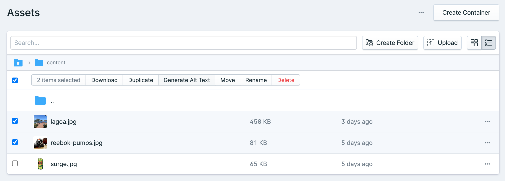

# A.I.D.A - AI-Driven Alt-text Assistant

<p align="left">
  <a href="https://github.com/21stdigital/statamic-aida/actions/workflows/release.yml">
    
  </a>
</p>

> Enhancing web accessibility and SEO through AI-generated alt texts for Statamic 4.

A.I.D.A is an addon for Statamic 4 that leverages AI to automatically generate descriptive alt texts for images. By simplifying this process, A.I.D.A aids in making web content more accessible to visually impaired users, enhances SEO, and supports content in multiple languages.

## Features

- **AI-Powered:** Utilizes AI to craft meaningful and contextually relevant alt texts.
- **Web Accessibility:** Improves accessibility for visually impaired users by providing descriptive image texts.
- **SEO Enhancement:** Boosts SEO by enabling search engines to better understand and index website images.
- **Multilingual Support:** Equally effective for both monolingual and multilingual websites.
- **Efficiency:** Saves time and resources by reducing manual effort required for writing alt texts.

## Getting Started

### Installation

1. Install the addon using Composer:

   ```bash
   composer require tfd/statamic-aida
   ```

### Configuration

To set up and customize the A.I.D.A addon, follow these steps:

1. **Publish Configuration File:** Start by publishing the addon's configuration file to make it editable. Run the following command in your terminal:

   ```bash
   php artisan vendor:publish --tag="aida-config"
   ```

   This will copy the default configuration file to your application's `config` directory, allowing you to customize the addon settings.

2. **Set OpenAI API Key:** A.I.D.A uses OpenAI to generate alt texts. You must provide your OpenAI API key for the service to function. It's recommended to set this key in your application's `.env` file for security reasons, rather than directly in the `aida.php` configuration file:

   Add the following line to your `.env` file:

   ```plaintext
   OPEN_AI_API_KEY=your_openai_api_key_here
   ```

   This ensures your API key remains secure and not hard-coded in your version-controlled files.

3. **Configure Queue:** To manage performance and efficiently handle multiple alt text generation requests, it's advisable to use a queue connection, such as Redis. Queues allow for asynchronous processing, improving the user experience and system performance.

   First, ensure you have your queue system set up according to the [Laravel documentation](https://laravel.com/docs/queues). Then, specify your queue connection for A.I.D.A by adding the following line to your `.env` file:

   ```plaintext
   GENERATE_ALT_TEXT_QUEUE=redis
   ```

   This tells A.I.D.A to use the `redis` queue connection for processing alt text generation jobs.

4. **Automatic Generation on Upload:** By default, the addon does not generate alt texts automatically upon image uploads to avoid unnecessary processing. However, you can enable this feature to have alt texts generated immediately as images are uploaded.

   To enable automatic alt text generation on upload, add the following line to your `.env` file:

   ```plaintext
   GENERATE_ALT_TEXT_ON_UPLOAD=true
   ```

   With this setting enabled, every new image uploaded will automatically have an alt text generated, enhancing accessibility and SEO with minimal effort.

### Usage

- **Manual Generation:** Use the **Generate Alt Text** action in the Asset Browser to generate alt texts for selected images. This option allows you to decide whether to override existing alt texts.

  

### Customization

- **Custom Generator:** You can replace the default OpenAI-based generator with your own by implementing the `TFD\AIDA\Generator\Generator` interface.

  1. Create a custom generator class e.g. `/app/Generator/MyAltTextGenerator.php`.

  ```php
    // app/Generator/MyAltTextGenerator.php

    <?php

    namespace App\Generator;

    use \Statamic\Assets\Asset;
    use TFD\AIDA\Generator\Generator;

    class MyAltTextGenerator implements Generator
    {
        /**
        * @param Asset $asset
        * @param string $language
        * @return string
        */
        public function generate($asset, $locale = 'en')
        {
            /**
            * Use some other service to get the alt text from the asset.
            * Depending on the service, you might have to transform the asset object
            * and use its url or base64 encoded string.
            */
            $altText = SomeApi::get($asset, $locale);

            return $altText;
        }
    }

    ?>
  ```

2. Implement the `generate` method to utilize your preferred service for generating alt texts.
3. Update the `aida.php` configuration file to use your custom generator class.

```php
  // config/statamic/aida.php

  <?php

  use App\Generator\MyAltTextGenerator;

  return [
      // ...

      'generator' => MyAltTextGenerator::class,

      // ...
  ];

  ?>
```

## Credits

This project is maintained by 21st digital. We appreciate the contributions from the community that help make this project better.
